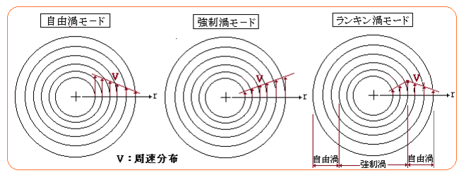

- Table of Content
{:toc}

### 24/8/15(Thu)
- [ ] 時間 : 1.5 hour
- [ ] 範囲 : 1-1 ~ 2-3

- 問題集を購入し、問題を解き始めた
- マクローリン展開を思い出した
- テンソル不変量は直交変換（回転）に対して不変
- [ストークスの定理](https://hooktail.sub.jp/vectoranalysis/StokesTheorem/) は、外側の渦しか残らないイメージ
- 動粘性係数は `m^2/s` の次元

### 24/8/16(Fri)
- [ ] 時間 : 1.0 hour
- [ ] 範囲 : 2-4

- CBT試験では電卓がある
- TIL いいかも
- 自由渦：流速は半径に反比例, 強制渦：剛体的な運動なので流速は半径に比例

--------- サンプル ----------
### 24/8/15(Thu)
- [ ] 時間 : 1.5 hour
- [ ] 範囲 : 1-1 ~ 2-3

- 問題集を解き始めた
